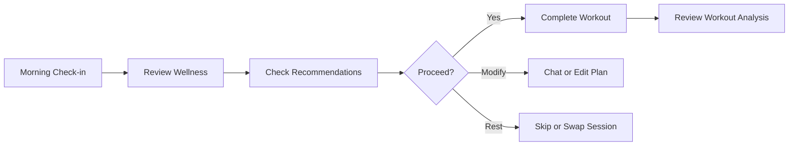

Your **Dashboard** is the command center for daily training decisions. It combines recovery data, training load, AI recommendations, and quick actions in one view.

## Dashboard layout

When your account is fully set up, the Dashboard shows:

- **Recovery & readiness** — HRV, sleep, and wellness scores from connected devices
- **Training load** — Fitness (CTL), Fatigue (ATL), and Form (TSB) trends
- **Today's guidance** — AI recommendation for your planned session
- **Recent activity** — Latest workouts with quick links to analysis

If you have not connected any apps yet, the Dashboard shows an **onboarding view** with connection cards for Intervals.icu, Strava, Garmin, Oura, and other services.

## Header actions

| Button            | Purpose                                              |
| ----------------- | ---------------------------------------------------- |
| **Sync**          | Pull the latest data from all connected integrations |
| **Upload**        | Manually upload a `.fit` workout file                |
| **Chat**          | Open a new conversation with your AI coach           |
| **Notifications** | Background job updates (plan generation, analysis)   |

## Morning routine

Coach Watts supports a structured morning workflow:

### Morning Check-in

Navigate to **Morning Check-in** from the sidebar. Log how you feel before the AI factors subjective feedback into today's recommendation:

- Sleep quality and duration (if not auto-synced)
- Muscle soreness and energy level
- Notes about stress, travel, or illness

### Today's Wellness

**Today's Wellness** shows your daily biometrics — resting heart rate, HRV, sleep stages, and recovery scores pulled from Garmin, Oura, WHOOP, or other connected devices.

Use this page to understand _why_ the AI may suggest easing off or pushing through.

## Daily decision workflow

A typical day in Coach Watts:

1. **Check recovery** — Dashboard or Today's Wellness
2. **Read today's recommendation** — [Recommendations](/documentation/athletes/recommendations) page or Dashboard widget
3. **Train or adjust** — follow the plan, ask Chat to modify, or accept a rest-day suggestion
4. **Review analysis** — after your workout syncs, open it in **Activities** for AI scores and feedback

## Syncing data

Data syncs automatically every few minutes. To force an update:

1. Click **Sync** in the Dashboard header
2. Or go to **Settings → Apps** and check each integration's status

::alert{type="info"}
If a workout does not appear within 10 minutes, see the troubleshooting section in your integration guide.
::

## New user onboarding view

Until you connect at least one integration, the Dashboard shows a guided setup:

1. **Intervals.icu** — highlighted as the recommended first connection
2. **Strava, Garmin, Oura, WHOOP** — secondary connection cards
3. **Profile setup** — link to configure FTP, zones, and availability

Complete at least one connection to unlock the full Dashboard grid.

## Related guides

- [Daily Recommendations](/documentation/athletes/recommendations)
- [Recovery & Wellness](/documentation/athletes/recovery-wellness)
- [Metrics & Scoring](/documentation/athletes/metrics-scoring)
- [Getting Started](/documentation/athletes/getting-started)
